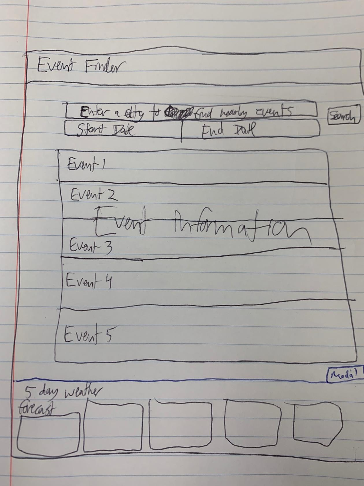

# Project1

## Project Title 

Revelry

## Project Description

A website that finds events on certain dates in particular cities and displays the event options and the current weather so that users can make an informed decision about which event to attend. 

## User Story

AS A person looking for an event to attend in a city
I WANT a list of events that I could attend in that city
SO THAT I have something to do

AS A person looking to attend an event in a city
I WANT to see weather information for that city
SO THAT I can decide if I want to attend a particular event based on the weather

## Wireframe/sketch of the design

## APIs to be used

*ticketmaster
*openweathermap
*jQuery

## Rough breakdown of tasks

*Write the HTML for the landing page
*Incorporate jQuery, ticketmaster, openweatherapp APIs
*Link Bulma CSS
*Create Navbar
*Create date/city fields w/ submit button
*Create event information section
*Create fixed weather forecast section (modal?)

*Style the CSS for the landing page
*Find a good font (or fonts)
*Ensure proper spacing

*Write JS
*AJAX calls for the APIs
*Populate weather forecast area with new divs for the forecast depending on city
*Populate the event information area with the events for the city in the dates